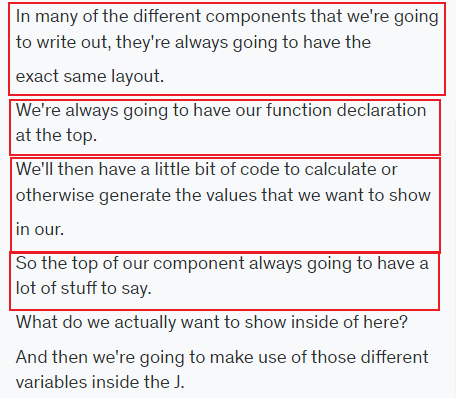
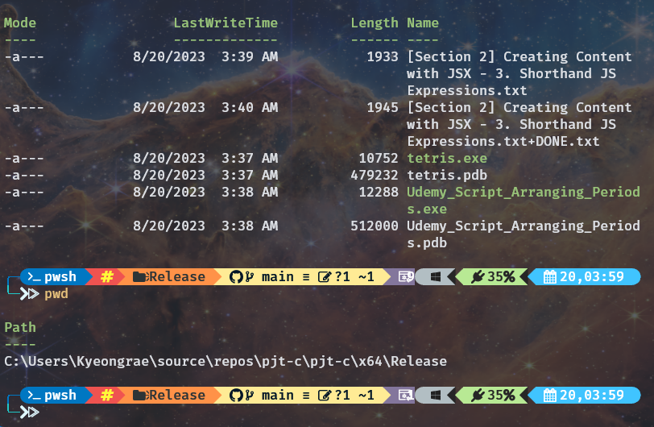
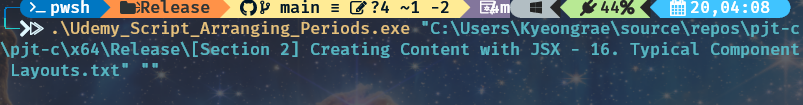
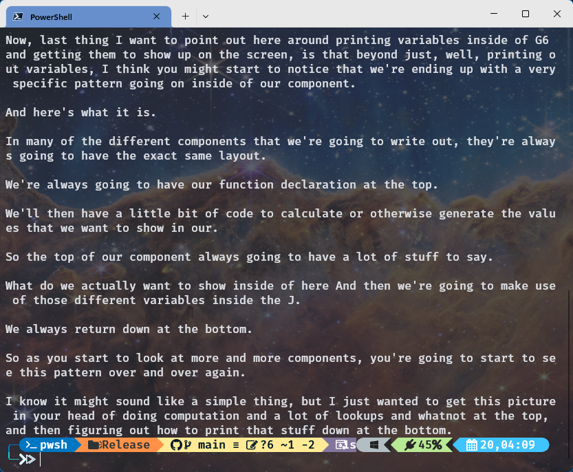
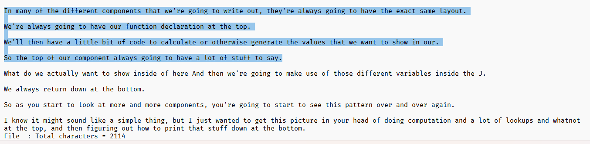

# pjt-c
This project contains some projects in C.
Basically the projects will be released for Windows OS.	[July-31-23]

## 0. Udemy Script Arranging Period [Aug-20-23]

<p>If you watch Udemy online videos by 'Auto-generated English' caption,</br>
then you will see the period of the sentence is not on the same line of the sentence.
Like below screenshot.</p>



<p>
This C program arranges the period on the right position of sentences.
It will be useful to translate the auto-generated script to your language.
For example, I translate the script to Korean by Deepl PC version.
</p>

---

### Usage

**0.** Prepare the transcript text file into the same directory of the excutable file.



**1.** Change directory to the path of the executable file on the command prompt (`Udemy_Script_Arranging_Periods.exe`)


**2.** Type this instruction and Enter.
```bash
.\Udemy_Script_Arranging_Periods.exe "file_name.txt" ""
```
You can drag the source text file into the command prompt window.



**3.** Check the output text file. the prompt displays output of the file.





This program counts the number of output characters for DeepL translation limit.
If you use the translator free, then 5,000 letters is the limit.